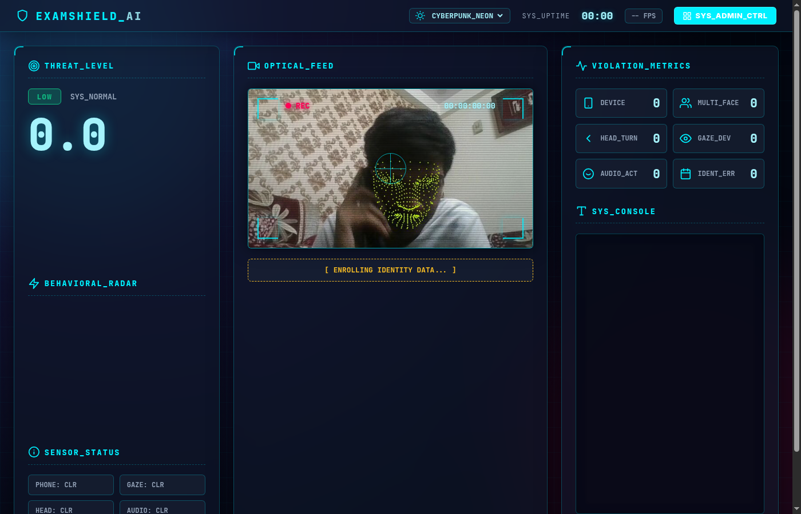
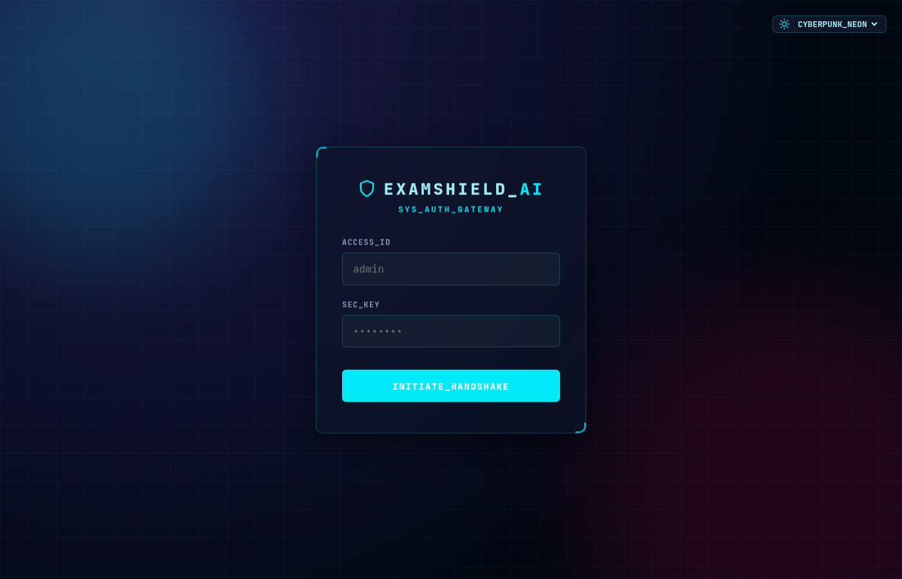

<h1 align="center">
  <br>
  🛡️ ExamShield AI
  <br>
</h1>

<h4 align="center">
  Computer Vision–Powered Online Examination Proctoring System
</h4>

<p align="center">
  <a href="https://www.python.org/downloads/release/python-3110/">
    
  </a>
  <a href="https://flask.palletsprojects.com/">
    
  </a>
  <a href="https://github.com/ultralytics/ultralytics">
    
  </a>
  <a href="https://mediapipe.dev/">
    
  </a>
  <a href="https://pytorch.org/">
    
  </a>
  <a href="LICENSE">
    
  </a>
</p>

<p align="center">
  <a href="#-features">Features</a> •
  <a href="#-architecture">Architecture</a> •
  <a href="#-quick-start">Quick Start</a> •
  <a href="#-api">API</a> •
  <a href="#-training">Training</a> •
  <a href="#-project-structure">Structure</a>
</p>

---

## Screenshots

<p align="center">
  
  <em>Candidate Monitoring Dashboard — live face mesh, threat score, violation metrics, Cyberpunk Neon theme</em>
</p>

<p align="center">
  
  <em>Admin Authentication Gateway</em>
</p>

---

## Overview

**ExamShield AI** is a real-time, computer vision–based examination proctoring system designed to detect suspicious behaviour during online assessments. It combines **YOLOv8 object detection**, **MediaPipe facial geometry**, **face recognition**, and a **probabilistic scoring engine** to generate a live suspicion score — all running locally on a standard webcam without cloud dependency.

Built as a B2B tool intended to be embedded into examination software platforms.

> **Stack**: Python · Flask · OpenCV · PyTorch · YOLOv8 · MediaPipe · SQLite · Chart.js

---

## ✨ Features

| Feature | Technology | Details |
|---|---|---|
| **Phone Detection** | YOLOv8n (COCO) | Real-time phone detection at 2 Hz via dedicated thread |
| **Multi-Face Detection** | YOLOv8n + MediaPipe | Detects additional persons in frame |
| **Head Pose Estimation** | MediaPipe 468-point mesh | Detects looking left/right/up/down with 9-frame smoothing |
| **Gaze Tracking** | MediaPipe blendshapes | 8 eye-look blendshapes fused, threshold 0.50, 9-frame smoothing |
| **Mouth State** | MediaPipe blendshapes | jawOpen score → open/speaking/closed |
| **Hand Proximity** | MediaPipe HandLandmarker | Detects hands near face region |
| **Identity Verification** | face_recognition + dlib | dlib 128-D embedding comparison every 2s |
| **Suspicion Scoring** | Weighted sum + decay | 0–100 score with configurable weights and time-decay |
| **Live Dashboard** | Flask + Chart.js + MJPEG | Real-time score graph, violation counters, live annotated feed |
| **Admin Dashboard** | Flask-SocketIO | Multi-candidate monitoring with session history |
| **Evidence Snapshots** | OpenCV JPEG | Auto-saved at HIGH risk (120s cooldown) |
| **Session Persistence** | SQLite | All events and session summaries stored |
| **CSV Export** | Flask endpoint | One-click session report download |
| **WebSocket Push** | Flask-SocketIO | Real-time telemetry, no polling required |
| **4 UI Themes** | Vanilla CSS | Cyberpunk Neon, Emerald Matrix, Solar Cyber, Studio Light |
| **CNN Training Pipeline** | PyTorch MobileNetV2 | Fine-tunable classifiers for head/gaze/mouth |

---

## 🏗️ Architecture

```
Webcam (OpenCV)
     │
     ▼
┌─────────────────────────────────────────────────────────────┐
│  Camera Class  (camera.py)                                  │
│                                                             │
│  Thread 1: _process_loop  (~30 FPS)                         │
│    ├── MediaPipe FaceLandmarker  (async LIVE_STREAM)        │
│    │     ├── 468-point mesh → head pose (9-frame majority)  │
│    │     └── Blendshapes  → gaze + mouth (9/7-frame)        │
│    ├── MediaPipe HandLandmarker  (async LIVE_STREAM)        │
│    ├── _process_violations()  [debounce + hysteresis]       │
│    └── _update_score()  [weighted sum + decay]              │
│                                                             │
│  Thread 2: _yolo_loop  (2 Hz)                               │
│    └── YOLOv8n inference → phone_detected, face_count      │
│                                                             │
│  Thread 3: _verify_identity_async  (0.5 Hz)                 │
│    └── dlib 128-D embedding → identity_mismatch            │
└─────────────────────────────────────────────────────────────┘
     │  suspicion_score, events, frames
     ▼
┌─────────────────────────────────────────────────────────────┐
│  Flask API  (app.py)  — 18 endpoints                        │
│    ├── /video      MJPEG annotated stream                   │
│    ├── /stats      JSON telemetry (polling fallback)        │
│    ├── /events     violation event log                      │
│    ├── /export     CSV session report                       │
│    └── WebSocket → stats_update + alert broadcasts         │
└─────────────────────────────────────────────────────────────┘
     │
     ▼
Browser Dashboards (frontend/)       SQLite DB (db.py)
  ├── Candidate Monitor              ├── events table
  └── Admin Dashboard                └── sessions table
```

### Violation Guard System

Every detection signal passes through **three layers** before counting:

```
Raw Signal ──► [Debounce 1-3s] ──► [Active Flag Set] ──► [Event Cooldown] ──► Logged
                                          │
                              [Hysteresis: 2-3s clear] ──► Flag Resets
```

This prevents noisy MediaPipe readings from flooding the event log with false positives.

### Scoring Formula

```
score += Σ(WEIGHT[signal] for each active violation)   # add on violation
score  = max(0, score - 0.3)                           # decay per frame when clear
score  = min(100, score)                               # cap at 100

LOW  = [0, 39]  |  MEDIUM = [40, 69]  |  HIGH = [70, 100]
```

---

## 🚀 Quick Start

### Prerequisites

- Python 3.11+
- Webcam
- Linux / macOS / Windows (WSL2 recommended on Windows)
- ~4 GB disk space (for model files)

### 1. Clone & Setup

```bash
git clone https://github.com/Aryansh909/Examshield-AI.git
cd Examshield-AI

# Create virtual environment
python -m venv venv
source venv/bin/activate      # Windows: venv\Scripts\activate

# Install dependencies
pip install -r requirements.txt

# Configure environment
cp .env.example .env          # Edit .env to set ADMIN_PASSWORD, SECRET_KEY
```

Or use the Makefile:
```bash
make setup
```

### 2. Download Models

```bash
bash scripts/download_models.sh    # Downloads MediaPipe .task files
python scripts/setup.py            # Creates required directories
```

> **YOLOv8n** (`models/yolo/yolov8n.pt`) downloads automatically on first run via `ultralytics`.

### 3. Run

```bash
python app.py
# or
make run
```

Open in your browser:

| Interface | URL |
|-----------|-----|
| 📹 Candidate Monitor | http://localhost:5000/ |
| 🔒 Admin Dashboard | http://localhost:5000/admin |

Admin credentials: `admin` / `admin` (change in `.env` before production use)

---

## 📊 Detection Details

### Suspicion Score Weights

| Violation | Weight | Threshold |
|-----------|--------|-----------|
| Identity Mismatch | **25** | 3+ consecutive mismatches |
| Phone Detected | **20** | YOLO confidence > 0.5, debounce 1.5s |
| Multiple Faces | **18** | 2+ faces, debounce 1.5s |
| No Face | **10** | 0 faces, 3s debounce |
| Head Turned | **8** | left/right/up/down, 1.5s debounce, 25s cooldown |
| Gaze Off-Screen | **8** | blendshape > 0.50, 2s debounce, 30s cooldown |
| Mouth Open | **5** | jawOpen > 0.35, 2s debounce, 25s cooldown |
| Hand Near Face | **4** | wrist landmark in face region |

### Head Pose Estimation

Uses the displacement vector between the nose tip and the face midpoint across the 468-point MediaPipe mesh:

```
dx, dy = nose.x - face_midpoint.x,  nose.y - face_midpoint.y

if |dx| > |dy|:  left/right  (yaw threshold: 0.04)
else:            up/down     (pitch threshold: 0.05)
```

### Gaze Estimation

Fuses 8 blendshapes (4 per eye) into a single directional score:

```
look_left  = eyeLookOutLeft  + eyeLookInRight
look_right = eyeLookOutRight + eyeLookInLeft
look_up    = eyeLookUpLeft   + eyeLookUpRight
look_down  = eyeLookDownLeft + eyeLookDownRight

if max(all) < 0.50 → "on-screen"
else → direction of maximum
```

---

## 📡 API

All endpoints documented in [`docs/api.md`](docs/api.md).

**Key endpoints:**

| Method | Endpoint | Auth | Description |
|--------|----------|------|-------------|
| GET | `/` | — | Candidate monitoring dashboard |
| GET | `/video` | — | MJPEG annotated live stream |
| GET | `/stats` | — | Real-time JSON telemetry (18 fields) |
| GET | `/events` | — | Last 100 violation events |
| GET | `/session_summary` | — | Current session statistics |
| POST | `/reset` | — | Reset session + re-enroll |
| GET | `/export` | 🔒 | CSV session report download |
| GET | `/history` | 🔒 | All past session summaries |
| POST | `/simulate` | 🔒 | Inject test violations |
| WS | `stats_update` | — | Real-time telemetry push |

**Example `/stats` response:**
```json
{
  "suspicion_score": 45.2,
  "risk_level": "MEDIUM",
  "face_count": 1,
  "gaze_direction": "on-screen",
  "head_direction": "forward",
  "phone_detected": false,
  "gaze_violations": 3,
  "head_violation_count": 2,
  "enrollment_complete": true,
  "fps": 28.4
}
```

---

## 🧠 Training Custom CNN Models

ExamShield includes a full training pipeline (`train_models.py`) using **MobileNetV2** with ImageNet pre-training and fine-tuned classification heads.

> **Note**: MediaPipe blendshape-based detection is used by default. Custom CNN models are an *override layer* — place `.pth` files in `models/ml/` to activate them.

### Dataset Format

```
datasets/
    head_pose/
        forward/   img001.jpg  img002.jpg ...
        left/      ...
        right/     ...
    gaze/
        on-screen/  ...
        off-screen/ ...
    mouth/
        open/    ...
        closed/  ...
        speaking/ ...
```

### Training

```bash
python train_models.py --model head  --data ./datasets/head_pose  --epochs 15
python train_models.py --model gaze  --data ./datasets/gaze       --epochs 15
python train_models.py --model mouth --data ./datasets/mouth      --epochs 15
```

**Training features:**
- MobileNetV2 backbone frozen (fine-tune classifier only)
- Data augmentation: `RandomHorizontalFlip`, `ColorJitter`, `RandomRotation`
- StepLR scheduler (step=3, gamma=0.5)
- Best checkpoint auto-saved per epoch

---

## 📁 Project Structure

```
examshield-ai/
├── app.py                    # Flask REST API + WebSocket server (18 endpoints)
├── camera.py                 # Core detection pipeline (~1200 lines, Camera class)
├── config.py                 # Centralised config + dotenv support
├── db.py                     # SQLite persistence layer
├── train_models.py           # MobileNetV2 CNN training pipeline
├── requirements.txt          # Pinned Python dependencies
├── Makefile                  # Developer convenience targets
├── .env.example              # Environment variable template
├── .gitignore
├── LICENSE
├── CONTRIBUTING.md
├── CHANGELOG.md
│
├── models/
│   ├── yolo/                 # yolov8n.pt  (auto-download)
│   │   └── README.md
│   ├── mediapipe/            # face_landmarker.task, hand_landmarker.task
│   │   └── README.md
│   └── ml/                   # head_model.pth, gaze_model.pth, mouth_model.pth
│       └── README.md
│
├── frontend/
│   ├── index.html            # Candidate monitoring HUD
│   ├── style.css
│   ├── admin.html            # Admin multi-student dashboard
│   ├── admin.css
│   └── login.html
│
├── scripts/
│   ├── setup.py              # Directory initialisation script
│   └── download_models.sh    # MediaPipe model downloader
│
├── docs/
│   ├── architecture.md       # System design and threading model
│   ├── api.md                # Full API reference with examples
│   └── scoring.md            # Scoring algorithm documentation
│
├── tests/
│   ├── test_config.py        # Config validation tests
│   ├── test_db.py            # SQLite CRUD tests
│   └── test_api.py           # Flask route smoke tests (mocked camera)
│
├── datasets/                 # Training data (gitignored)
│   └── README.md
│
└── snapshots/                # Evidence frames (gitignored)
```

---

## 🔧 Configuration

All settings can be configured via environment variables or a `.env` file:

| Variable | Default | Description |
|----------|---------|-------------|
| `FLASK_HOST` | `0.0.0.0` | Server bind address |
| `FLASK_PORT` | `5000` | Server port |
| `FLASK_DEBUG` | `false` | Enable Flask debug mode |
| `ADMIN_PASSWORD` | `admin` | Admin dashboard password |
| `SECRET_KEY` | *(dev key)* | Flask session signing key |
| `CAMERA_INDEX` | `0` | Webcam device index |

```bash
# .env example
ADMIN_PASSWORD=my-secure-password
SECRET_KEY=super-random-secret-key-here
CAMERA_INDEX=0
```

---

## 🧪 Running Tests

```bash
make test
# or
pytest tests/ -v
```

Tests use a **mocked Camera class** — no webcam required. The test suite covers:
- Config key validation
- SQLite schema + CRUD operations
- All 12 Flask route smoke tests (including auth enforcement)

---

## 📋 Requirements

### Core
- Python 3.11+
- OpenCV-compatible webcam
- ~500 MB RAM minimum (YOLO + MediaPipe)

### Optional (degrade gracefully)
- GPU (CUDA) — YOLO runs faster; falls back to CPU
- `face_recognition` / `dlib` — identity verification; disabled if absent
- Custom CNN `.pth` files — MediaPipe blendshapes used if absent
- `flask-socketio` — WebSocket push; polling fallback if absent

---

## 🙏 Acknowledgements

| Technology | Use |
|---|---|
| [Ultralytics YOLOv8](https://github.com/ultralytics/ultralytics) | Phone + face object detection |
| [MediaPipe](https://mediapipe.dev/) | Face mesh (468 pts), hand landmarks, blendshapes |
| [face_recognition](https://github.com/ageitgey/face_recognition) | dlib-based identity verification |
| [PyTorch / torchvision](https://pytorch.org/) | MobileNetV2 CNN fine-tuning |
| [Flask](https://flask.palletsprojects.com/) | REST API + MJPEG streaming |
| [Flask-SocketIO](https://flask-socketio.readthedocs.io/) | WebSocket real-time broadcast |
| [Chart.js](https://www.chartjs.org/) | Live score visualisation |
| [scikit-learn](https://scikit-learn.org/) | LabelEncoder for CNN training |

---

## 📄 License

MIT License — see [LICENSE](LICENSE) for details.

---

<p align="center">
  Built by <a href="https://github.com/Aryansh909">Aryan Sharma</a>
  &nbsp;·&nbsp;
  <a href="https://github.com/Aryansh909/Examshield-AI/issues">Report a Bug</a>
  &nbsp;·&nbsp;
  <a href="docs/api.md">API Docs</a>
  &nbsp;·&nbsp;
  <a href="docs/architecture.md">Architecture</a>
</p>
